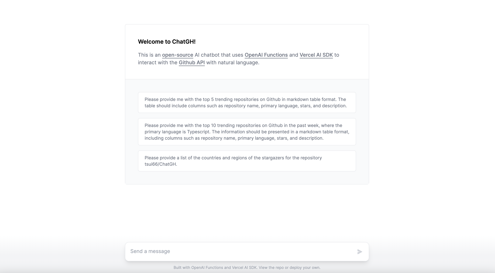

<a href="">
  
  <h1 align="center">ChatGH</h1>
</a>

## Introduction

ChatGH is an open-source AI chatbot that uses [OpenAI Functions](https://platform.openai.com/docs/guides/gpt/function-calling) and the [Vercel AI SDK](https://sdk.vercel.ai/docs) to interact with the [Github API](https://github.com/pingcap/ossinsight) with natural language.

## Setting Up Locally

To set up ChatGH locally, you'll need to clone the repository and set up the following environment variables:

- `OPENAI_API_KEY` – your OpenAI API key (you can get one [here](https://platform.openai.com/account/api-keys))

## Tech Stack

ChatGH is built on the following stack:

- [Next.js](https://nextjs.org/) – framework
- [OpenAI Functions](https://platform.openai.com/docs/guides/gpt/function-calling) - AI completions
- [Vercel AI SDK](https://sdk.vercel.ai/docs) – AI streaming library
- [Vercel](https://vercel.com) – deployments
- [Turborepo](https://turbo.build/) – build tool
- [TailwindCSS](https://tailwindcss.com/) – styles
- [OSSInsight Public APIs](https://ossinsight.io/docs/api) - Github APIs alternative

## Contributing

Here's how you can contribute:

- [Open an issue](https://github.com/tsui66/ChatGH/issues) if you believe you've encountered a bug.
- Make a [pull request](https://github.com/tsui66/ChatGH/pull) to add new features/make quality-of-life improvements/fix bugs.

## Author

- Tsui ([@tsui_nova](https://twitter.com/@tsui_nova))

## License

Inspired by [ChatHN](https://github.com/steven-tey/chathn), ChatGH is an open-source AI chatbot that uses [OpenAI Functions](https://platform.openai.com/docs/guides/gpt/function-calling) and the [Vercel AI SDK](https://sdk.vercel.ai/docs) to interact with the [Github API](https://github.com/pingcap/ossinsight) with natural language.
