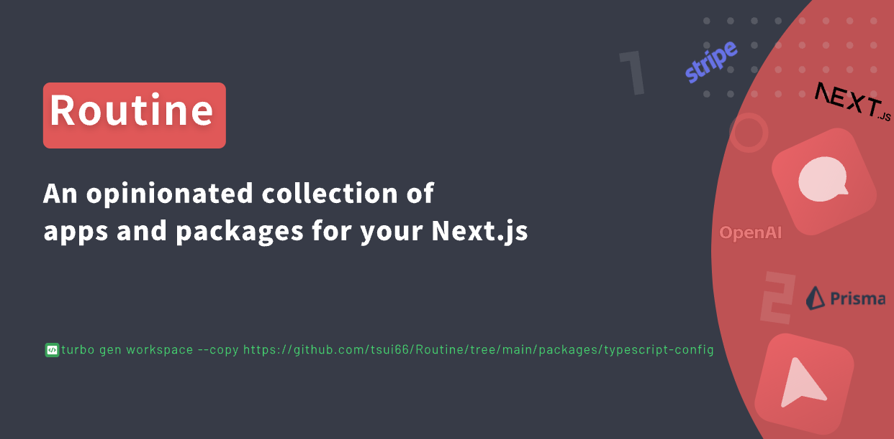

<a href="">
  
  <h1 align="center">Routine</h1>
</a>

  An opinionated collection of apps and packages for your Next.js monorepo project.

## Introduction

Extend your Turborepo with new apps, and packages. Create new empty workspaces, copy existing workspaces, add workspaces from Routine.
